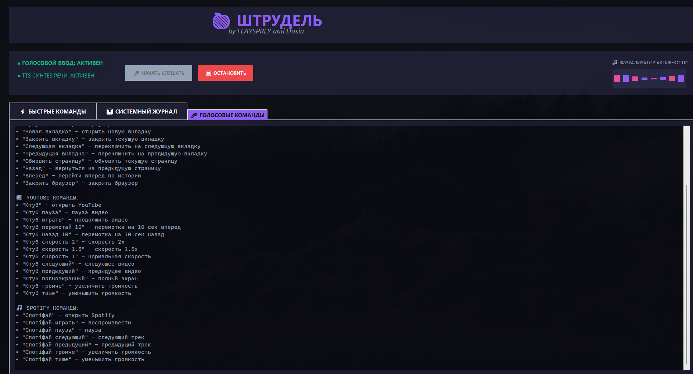

# ❓ Не открывается программа? Установите данные модули:
```
pip install speech_recognition

pip install pyttsx3

pip install psutil
```

# 📸 Скриншоты
<p align="center"></p>
<p align="center"></p>


